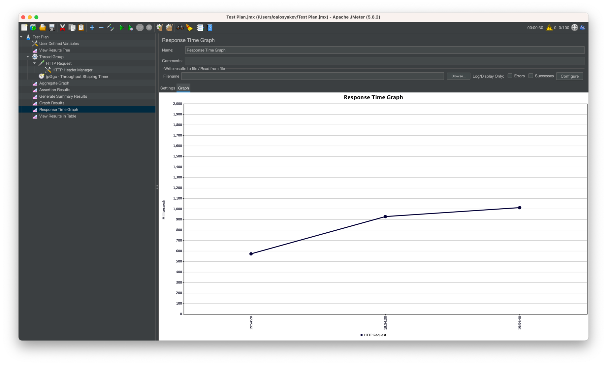

## Отчет по индексам

# Запросы без индекса

1. RPS 1

2. RPS 10

3. RPS 100

4. RPS 1000 - не держим

# Запросы с индексом

Добавлен GIN индекс на два поля
`UPDATE pg_opclass SET opcdefault = true WHERE opcname='gin_trgm_ops';`
`CREATE INDEX IF NOT EXISTS user_data_search_index ON user_data USING gin (first_name, second_name);`

4. RPS 1000 

## Explain запроса

## Почему GIN индекс с триграммами

GIN индекс для хранения триграмм использует B-дерево, в листьях которого содержаться триграммы и ссылки на строки таблицы, в которых эти триграммы встречаются.
Поиск по GIN индексу обычно производится быстро, т.к. в отличии от GiST лишние обходы не производятся. Однако, он не умеет производить поиск в глубину, а значит, что не может сразу вернуть нам первые найденные элементы. При использовании LIMIT в начале будут получены все результаты, а затем будет выполнена выборка первых элементов. Таким образом, если элементов много, то поиск будет медленным.
Итак, по сравнению с GiST, GIN индекс производит поиск быстрее и занимает меньше места, но он не умеет возвращать первые найденные результаты сразу.

Помимо разных функций similarity, которые мы разобрали ранее, индексы GiST и GIN для триграмм также поддерживают операторы LIKE и ILIKE
 
У нас нет лимита на запрос поэтому нам не интересны GIST индексы. 