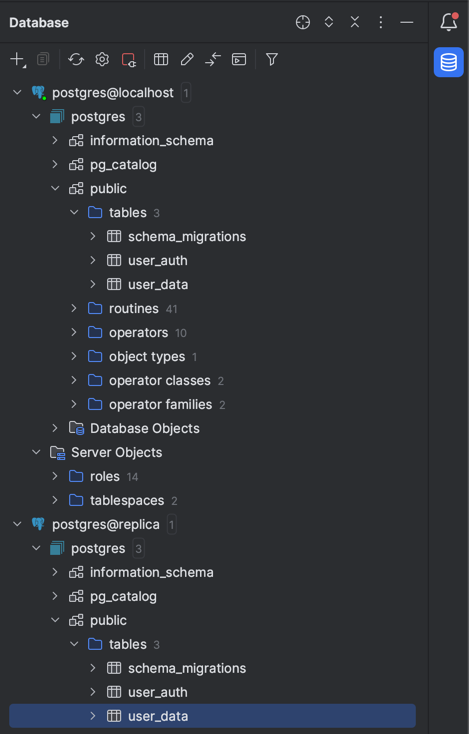
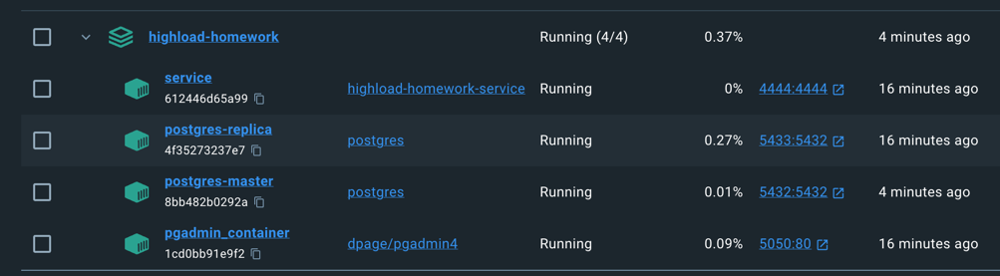
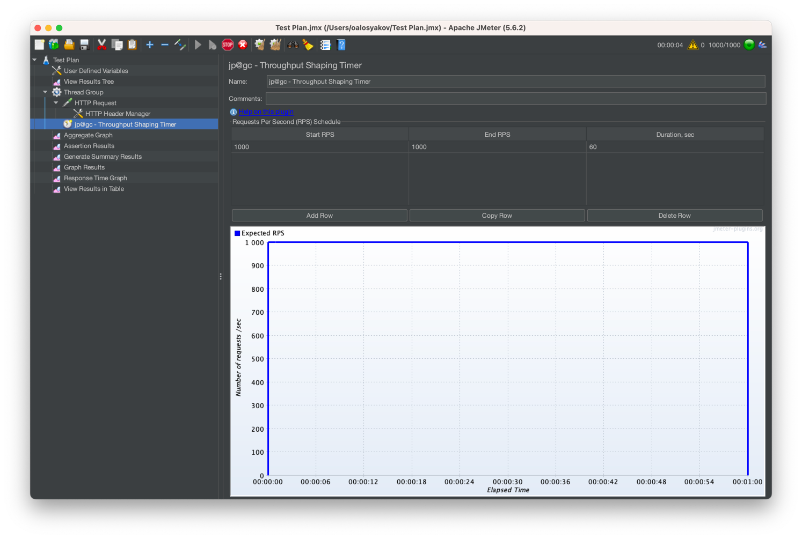
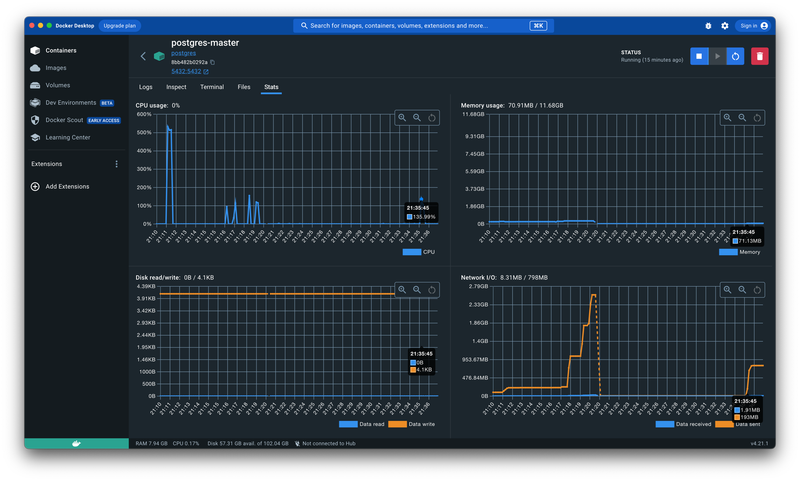
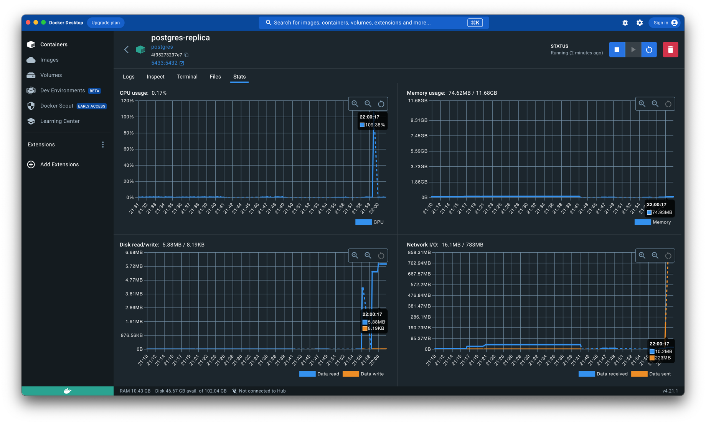
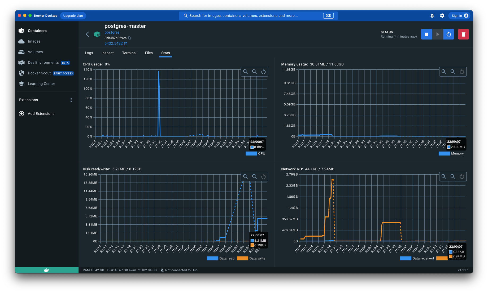
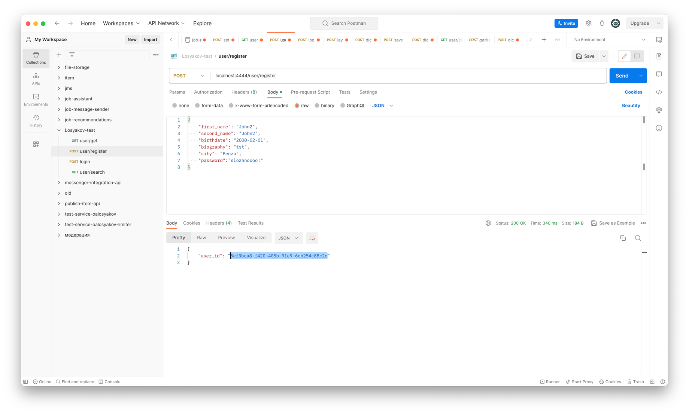
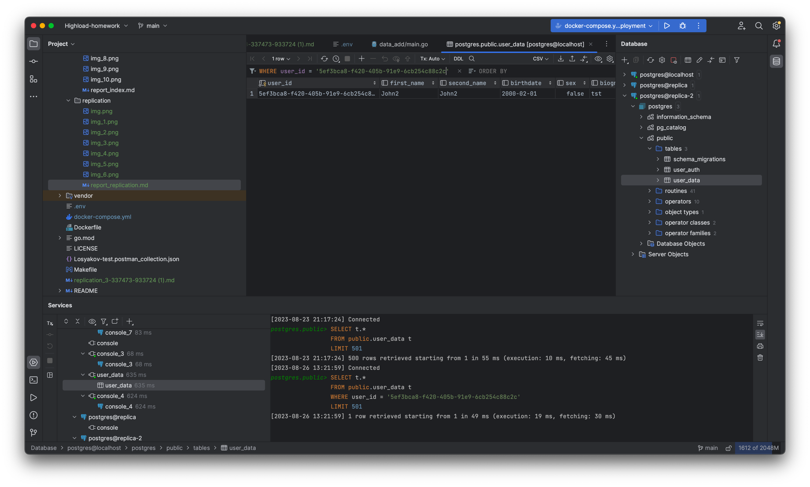
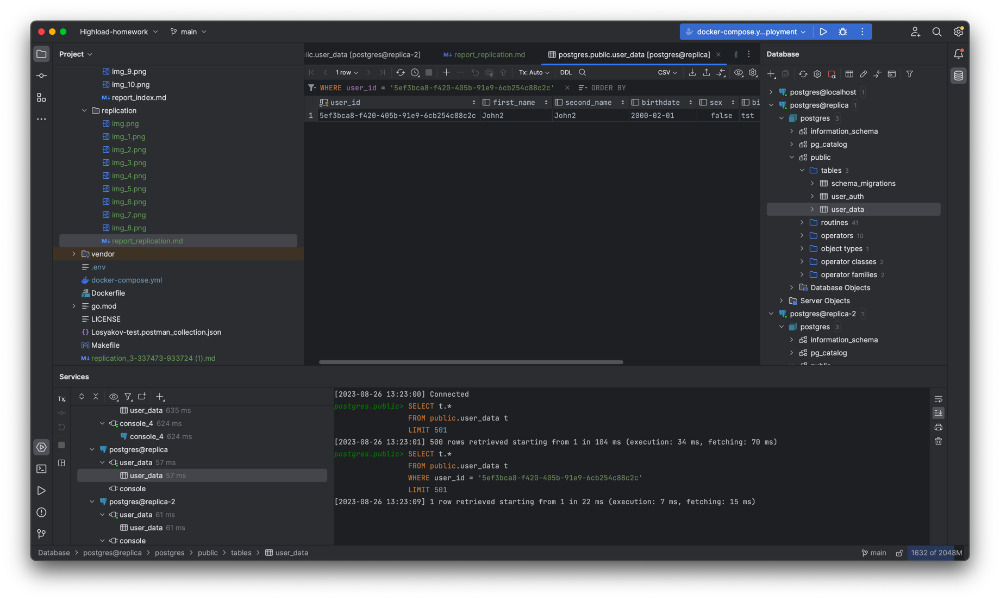
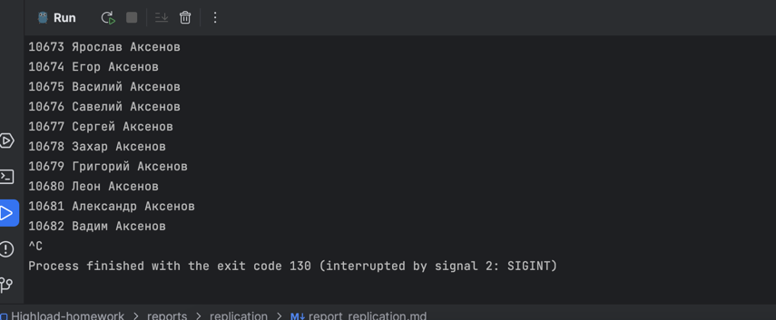

## Отчет по репликации

# Настройка репликации

Была настроена асинхронная репликация по гайду из лекции

1. Поднимаем мастера и реплику из docker-compose
2. Меняем postgresql.conf на мастере
   ssl = off wal_level = replica max_wal_senders = 4 # expected slave num
3. Подключаемся к мастеру и создаем пользователя для репликации
   docker exec -it postgres-master su - postgres -c psql

    create role replicator with login replication password 'pass';

    Добавляем запись в pg_hba.conf с localhost
    local   replication     replicator                              md5
4. Перезапустим мастера
5. Сделаем бэкап для реплик
   docker exec -it postgres-master bash mkdir /data-replica

6. pg_basebackup -h pgmaster -D /postgres-replica -U replicator -v -P --wal-method=stream

7. Копируем директорию себе
docker cp postgres-master:/postgres-replica postgres-replica 
8. Создадим файл, чтобы реплика узнала, что она реплика
touch postgres-replica/standby.signal 
9. Меняем postgresql.conf на реплике
primary_conninfo = 'host=postgres-master port=5432 user=replicator password=pass application_name=postgres-replica'
   synchronous_commit = off
10. Запускаем реплику

# Нагрузочное тестирование до перевода ручек на реплику

# Переводим ручки на реплику
`data, err := app.dbReplica.GetUserDataByID(userID)`
`usersData, err := app.dbReplica.SearchUserData(input.FirstName, input.SecondName)`

# Повторяем нагруочное тестирование

1. Реплика

2. Мастер

# Поднимаем вторую реплику, аналогично первой 
1. Проверяем, что записи идут в мастер и в 2 реплики

мастер:

реплика:

реплика 2:

# Начали писать в базу

1. в мастере 1007598 записей 
2. на первой реплике 1007598
3. на второй реплике 1007598
4. можем переключить мастера, но транзакции не успели потеряться
